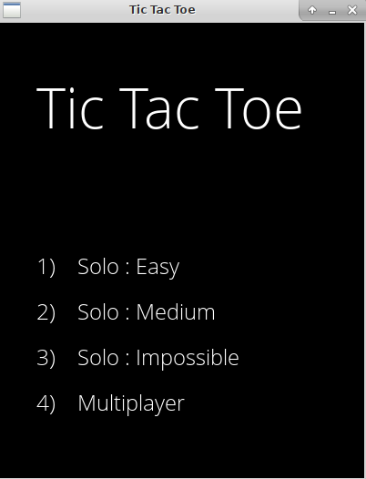
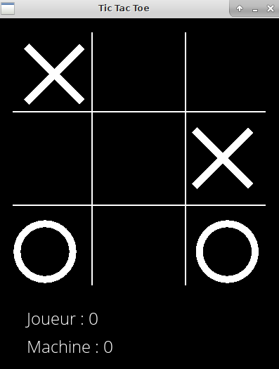
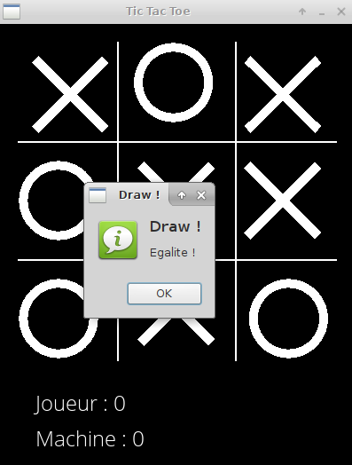

## Tic Tac Toe with Allegro

### Presenteation

Le jeu de Tic Tac Toe implémenté en C avec la bibliothéque Allegro5.
Propose un mode Solo et un mode multijoueur.
Le mode Solo propose 3 niveaux :

* Easy (facile) : L'ordinateur joue de facon aléatoire (faut vraiment le vouloir pour perdre x) ).
* Medium (Moyen) : L'ordinateur essaie de gagner ET d'éviter de perdre mais il reste tout de meme possible de le vaincre.
* Impossible : Implémenté en MiniMax, vous ne gagnerez jamais, l'ordinateur traite touts les cas possibles et ne choisit que ceux
où il est gagant (ou au pire n y est pas perdant).

### technologies utilisés

Le jeu a été codé en C, grace à la bibliothéque [ALlegro5](http://liballeg.org/).

### Demonstration

